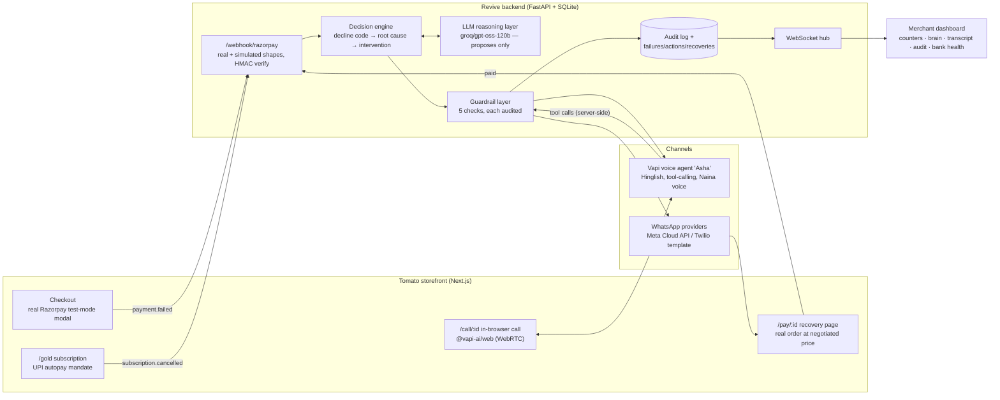

# 🛡️ Revive — AI Revenue Recovery for Razorpay merchants

**Razorpay AI Buildathon · Track 03 (AI Revenue Recovery)** · by Pari Singhal

Razorpay's native retry is time-based — T+1/T+2/T+3 — regardless of **why** a payment failed. Retrying an expired card tomorrow is always wasted; calling a hesitant customer works. **Revive diagnoses the decline code first**, picks a bounded intervention (Hinglish voice call, WhatsApp UPI link, smart-timed retry, bank-outage hold, subscription save), runs it through five server-side guardrails, and measures the rupees it brings back — with every decision, check, and action written to an audit trail *before* it executes.

```
payment.failed ──► DECISION LAYER ──► GUARDRAILS ──► BOUNDED ACTION ──► ₹ RECOVERED
  (webhook)        decline code →      5 checks,      voice / WhatsApp /   live counters,
                   root cause →        audited BEFORE  retry / hold /      audited, and
                   intervention        any action      mandate-save        reproducible
```

---

## Measured on a batch, not a demo

One command, **zero API keys**, fresh isolated database, deterministic seed:

```bash
cd backend && pip install -r requirements.txt && python demo.py
```

| Metric | Value (n=500, seed=42) |
|---|---|
| ₹ at risk | **₹19,41,916** |
| ₹ recovered | **₹9,60,695** (250 payments) |
| Recovery yield | **50.0%** |
| Fraud suppressed | 2 cases — ₹200 **deliberately not chased** (card-testing pattern) |
| Outage handling | 18 HDFC retries **held during the outage**, released as a batch on recovery |
| Honest losses | **244 cases (₹9,70,867) — reported, not hidden** |

The committed [`results/batch_report.json`](results/batch_report.json) was produced by exactly this command. Re-run it: the numbers reproduce to the rupee (`tests/test_batch.py::test_batch_is_reproducible_for_a_fixed_seed` proves it in CI). A batch with zero losses would be cherry-picked; this one resolves each intervention at honest, decline-code-dependent success rates.

## Verify this repo in five minutes (for reviewers)

```bash
# 1. Guardrails, engine routing, LLM-boundary, batch honesty — 18 tests
cd backend && pip install -r requirements-dev.txt && python -m pytest tests -q

# 2. The headline numbers, reproducibly, keyless
python demo.py --n 500 --seed 42

# 3. The full product (still keyless — simulated gateway + policy table)
uvicorn app.main:app --port 8000          # backend
cd ../frontend && npm install && npm run dev   # storefront http://localhost:3000
# open /dashboard, buy something at /, fail the payment, watch the audit trail
```

Everything degrades gracefully without keys: no LLM key → deterministic policy table (audited as such); no Razorpay key → simulated card picker; no Vapi/WhatsApp keys → decisions and audit rows still flow. CI (`.github/workflows/ci.yml`) runs the tests and the reproducible batch on every push.

---

## Architecture



**Component map**

| Piece | File | What it does |
|---|---|---|
| Webhook ingress | `backend/app/main.py` | Accepts real Razorpay `payment.failed` (`payload.payment.entity` + `X-Razorpay-Signature` HMAC-SHA256) and simulated flat events on one endpoint; reload-safe order reconciliation via Razorpay's order-payments API |
| Decision engine | `backend/app/engine.py` | Decline code → root cause → intervention; fraud check first on every failure; bank hold/release; recovery recording (idempotent, discount-aware) |
| LLM layer | `backend/app/llm.py` | "LLM proposes, rules dispose" (details below) |
| Guardrails | `backend/app/guardrails.py` | The five checks — every pass AND every block writes an audit row |
| Voice agent | `backend/app/voice.py` | Transient Vapi assistant built per call: Hinglish persona, 5 server-guarded tools, live transcripts + intent chips, bounded call duration, auto-hangup |
| WhatsApp | `backend/app/whatsapp.py` | Provider chain with the production template path documented in-file |
| Razorpay gateway | `backend/app/razorpay_gw.py` | Orders API, webhook signature verification, error-taxonomy → decline-code mapping (tested) |
| Batch simulator | `backend/app/simulator.py` | The measurement harness (methodology below) |
| Persistence | `backend/app/db.py` | SQLite, single file, zero external services; `REVIVE_DB_PATH` for isolation |
| Dashboard | `frontend/src/app/dashboard/` | Live command center: cumulative-recovery chart, yield-vs-target, KPI row, agent brain, transcript with intent chips, audit stream, bank-health strip with one-click recovery release |

## The decision layer: LLM proposes, rules dispose

Two decision paths, both audited with which one decided:

1. **Live traffic** — the LLM (Groq `gpt-oss-120b`, or Gemini, via OpenAI-compatible endpoints) receives the failure context: decline code, amount, method, bank health, IST hour, and the customer's recent failure velocity. It must return JSON choosing **one of five menu actions** with a root cause, reasoning, and confidence. The reasoning streams to the dashboard's Agent Brain panel tagged with the model name.
2. **Batch runs & keyless mode** — the deterministic policy table (`engine.py:DECISION_TABLE`) decides. Batches always use it, for reproducibility and honest measurement; the batch's first audit row discloses this.

The LLM's authority is deliberately narrow:

- **Off-menu proposals are rejected** by a validator and the table takes over — with an audit row saying so (`tests/test_engine.py::test_out_of_menu_llm_proposal_is_rejected`). Bounded actions mean bounded *even for the model*.
- It never sets amounts, touches money, or bypasses a guardrail — every action it picks still passes all five checks.
- Domain priors are explicit in the prompt (OTP abandonment = hesitation → call converts best; card problems → UPI pivot; gateway noise → silent retry), and the model may deviate only with a concrete stated reason — which produces genuinely non-hardcoded behavior: a ₹159 order gets a WhatsApp link ("a call is intrusive for this amount"), a ₹1,500 one gets a call, and at 11 PM it reasons about not waking the customer.

| Decline code | Root cause | Intervention |
|---|---|---|
| `AUTHENTICATION_FAILED` | OTP/3DS abandoned — hesitation | Hinglish voice call, bounded negotiation |
| `CHECKOUT_ABANDONED` | Price hesitation | Voice call, ≤10% discount authority |
| `CARD_EXPIRED` | Retry is always wasted | WhatsApp link → pay by UPI instead |
| `PAYMENT_DECLINED` / `TXN_LIMIT_EXCEEDED` | Issuer/limit | WhatsApp link, alternate method |
| `INSUFFICIENT_FUNDS` | No balance ≠ no intent | Retry scheduled for the 1st (salary day) |
| `GATEWAY_ERROR` / `SERVER_ERROR` | Transient | Silent retry T+30min — customer never bothered |
| `ISSUER_DOWN` | Bank outage | **Hold ALL retries for that bank**; release as a batch on recovery, then send UPI links |
| `MANDATE_CANCELLED` | Subscription churn | Save-outreach with pause→downgrade ladder + autopay restart link → MRR saved |

## Guardrails — stopping rules and compliant escalation

Every check runs **before** the action and writes an audit row whether it passes or blocks (`backend/app/guardrails.py`, each verified in `tests/test_guardrails.py`):

| # | Guardrail | Rule | On trip |
|---|---|---|---|
| 1 | **TRAI quiet hours** | No outbound calls 9 PM–9 AM IST (window editable from the dashboard sandbox) | Action **QUEUED** until the window ends, never placed |
| 2 | **Opt-out blacklist** | "call mat karo" → permanent | All contact **HALTED**, across all future failures |
| 3 | **Discount ceiling** | 10% hard cap, checked server-side | Tool call **BLOCKED** — the voice agent cannot exceed it no matter what it says |
| 4 | **Contact budget** | Max 1 outbound contact per failure | Re-contact **BLOCKED** (no spam) |
| 5 | **Fraud velocity** | ≥5 failures/60s from one source | Recovery **SUPPRESSED** — an agent that knows when *not* to recover money |

Plus bounded calls (15s silence timeout, 5-minute hard cap) and a batch-mode kill switch that suppresses all external sends during simulations (`tests/test_batch.py::test_batch_never_sends_external_messages`).

## The voice agent

"Asha" is a transient Vapi assistant built per call (`voice.py:build_vapi_assistant`) — no dashboard config, fully reproducible from code. Hinglish persona (Vapi's `Naina` Indian voice, slightly slowed), Deepgram `hi` transcription, GPT-4o-mini conversation. Her five tools all execute **server-side through the guardrails**: `apply_discount` (ceiling-checked), `send_upi_link` (WhatsApp mid-call), `schedule_retry`, `opt_out` (instant blacklist + hang up), and `check_payment_status` — so when the customer pays the link mid-call and says "ho gaya", she verifies against the database before celebrating "payment mil gaya!". Final transcripts stream to the dashboard with LLM-classified intent chips (`PRICE_OBJECTION` / `OPT_OUT` / `NO_FUNDS` / `AGREEMENT`); she hangs up on her own when the conversation is done.

## Real Razorpay rails

- **Orders API** — every checkout and every recovery page creates a real test-mode order (recovery orders at the *negotiated* price, so the discount is visible in the Razorpay dashboard too).
- **Real Checkout** — `checkout.js` modal, `payment.failed` client events for sub-second UX, plus the server-verified webhook path.
- **Webhook signature verification** — HMAC-SHA256 against `RAZORPAY_WEBHOOK_SECRET`; unsigned webhooks are accepted but explicitly audited as unverified.
- **Reload-safe reconciliation** — if a redirect wipes the page mid-payment, the order is reconciled through Razorpay's order-payments API (dedup by `order_id`).
- **Error-taxonomy mapping** — Razorpay's `error_code/reason/description/step` are mapped to Revive's decline codes with substring-tolerant matching (`razorpay_gw.py:map_failure`, tested). Test mode only emits generic failure reasons, so the checkout offers a disclosed "treat this decline as X" overlay — transport real, taxonomy overlaid, audited as such.

## Batch methodology (why the numbers are defensible)

`simulator.py` generates a failure stream with a decline-code distribution modeled on India payment-failure patterns (issuer/bank issues dominate, then customer drop-off, then gateway noise), then injects two adversities mid-batch: an **18-failure HDFC outage cluster** (the agent must hold, not hammer) and a **6-failure card-testing burst** (the agent must suppress, not chase). Recovery is only *attempted* where the engine chose an intervention, and succeeds at honest per-code probabilities (e.g., silent retries on transient gateway errors land ~80%; issuer declines only ~35%). Discounts on voice recoveries follow the negotiation ladder distribution (most calls need none). Everything is seeded — same seed, same rupees.

## Buildathon bar → where it's met

| Judging signal | Where |
|---|---|
| **Measured ₹ on a batch, not demos** | `demo.py` + committed `results/batch_report.json` + reproducibility test |
| **Audit trail** | Every decision/check/action writes a row *before* execution (`events.py:audit`); dashboard streams it live; `/api/audit` serves it |
| **Bounded, gated money actions** | 10% ceiling server-side; 5-action LLM menu with validator; voice tools have no direct money authority; recovery orders created only at guarded prices |
| **Stopping rules** | Opt-out blacklist, contact budget, fraud suppression, quiet-hours queueing, bank holds |
| **Compliant escalation** | TRAI quiet hours; consent-gated contact; opt-out is permanent and honored across failures |
| **Honest failure reporting** | 244 losses in the headline report; keyless fallbacks audited as such; workarounds disclosed in audit rows themselves |
| **Graceful failure handling** | Issuer outage → hold & batch-release; LLM timeout → policy table ("graceful degradation" audit row); WhatsApp/voice provider failures audited, flow continues |
| **Uses Razorpay rails** | Orders, Checkout, webhooks + signatures, order-payments reconciliation, error taxonomy, subscriptions story (mandate save → MRR) |

## Free-tier engineering (disclosed, with production paths in-code)

This was built entirely on free tiers as a student project. Each workaround is disclosed in the audit rows it writes, and the production path is documented as commented reference code beside it:

| Capability | Demo implementation | Production path (documented at) |
|---|---|---|
| Outbound phone ring | Vapi **SIP→SIP** call to a free Linphone account (free Vapi numbers can't dial +91 PSTN) | One-line change to a paid imported number — `voice.py`, "PRODUCTION PATH" block |
| WhatsApp delivery | Meta Cloud API test number / personal-use bridges | Verified WABA sender + approved Utility template — `whatsapp.py`, "PRODUCTION PATH" block |
| Decline variety | Disclosed scenario overlay on real test-mode events | Live mode emits real taxonomy; overlay layer deletes cleanly |
| Bank-recovery signal | Manual "bank up" control on the dashboard | Razorpay `payment.downtime.started/resolved` webhooks drive hold/release |
| UPI collect | Simulated approval on the recovery page when keyless; real test-mode modal when keyed | Same page; production account enables live UPI |

## Trust & anti-phishing design

An unsolicited payment link is structurally identical to a scam, so the design assumes suspicion: messages quote the exact order ID and amount seconds after the customer's own failed attempt; on calls the link is announced before it arrives; the link opens the merchant's own payment page where the customer initiates payment in their **own** UPI app (no OTP/PIN is ever requested — the opposite of the collect-request scam pattern); and paying from the app remains an alternative path. Production adds the verified-business sender badge.

## Repository layout

```
├── backend/
│   ├── app/
│   │   ├── main.py            # FastAPI routes: webhook, checkout, voice, sandbox, dashboard APIs
│   │   ├── engine.py          # decision engine + bank holds + recovery recording
│   │   ├── llm.py             # bounded LLM proposals (Groq/Gemini) + intent classifier
│   │   ├── guardrails.py      # the five checks
│   │   ├── voice.py           # Vapi assistant, tools, transcripts, SIP calling
│   │   ├── whatsapp.py        # provider chain + production template path
│   │   ├── razorpay_gw.py     # Orders API, HMAC verify, error-taxonomy mapping
│   │   ├── simulator.py       # measurement harness
│   │   ├── db.py              # SQLite schema + helpers
│   │   └── events.py          # audit writer + WebSocket hub + metrics
│   ├── tests/                 # 18 tests: guardrails, routing, LLM boundary, batch honesty
│   ├── demo.py                # one-command reproducible proof run
│   ├── requirements.txt / requirements-dev.txt
│   └── start.example.ps1      # env template (no secrets in repo)
├── frontend/
│   └── src/
│       ├── app/               # / (storefront) /checkout /gold /pay/[id] /restart-autopay/[id]
│       │                      # /call/[id] (WebRTC phone UI) /dashboard (command center)
│       ├── components/ui/     # menu-item-card, clipped-area-chart, timeline-animation
│       └── lib/               # api client + ws, menu data, utils
├── results/batch_report.json  # committed evidence for the headline numbers
├── .github/workflows/ci.yml   # tests + reproducible batch + frontend type-check
└── LICENSE                    # MIT
```

## Full-stack setup (optional keys)

Copy `backend/start.example.ps1` → `start.ps1` and fill in what you have — every key is optional and the README's claims are all verifiable without any. For live voice: a free Vapi account, a cloudflared quick tunnel (`cloudflared tunnel --url http://localhost:8000`) as `PUBLIC_URL`, and optionally a free Linphone SIP account to make the demo phone actually ring. For real gateway events: Razorpay test-mode keys (no KYC). For the LLM brain: a free Groq key. Frontend env goes in `frontend/.env.local`: `NEXT_PUBLIC_BACKEND_TUNNEL` (tunnel URL, for phone journeys) and `NEXT_PUBLIC_VAPI_PUBLIC_KEY` (Vapi browser key, required for the in-page WebRTC call).

## Honest limitations

- Batch metrics use the deterministic policy table; the LLM routes live traffic only, so **LLM lift over the table is unmeasured** (an A/B batch is the obvious next experiment).
- Recovery success probabilities in the simulator are modeled, not learned from production data — the yield number demonstrates the measurement harness, not a market claim.
- Scheduled retries are recorded intents; a production system needs a real scheduler executing them against stored tokens/mandates.
- Test mode can't exercise live UPI collect or mandate debits; the subscription-save flow simulates the mandate re-authorization.
- Single-merchant, single-process deployment; production needs multi-tenancy, queueing, and idempotent webhook consumption at scale.

## Roadmap to production

Razorpay downtime-webhook-driven bank holds → real retry scheduler with mandate-rule compliance (pre-debit notification windows, RBI caps) → verified WABA + approved templates → learned per-code recovery probabilities from live outcomes → A/B: policy table vs LLM routing on live traffic → promise-to-pay tracking closing the loop.

---

MIT © 2026 Pari Singhal · built for the Razorpay AI Buildathon (Track 03)
